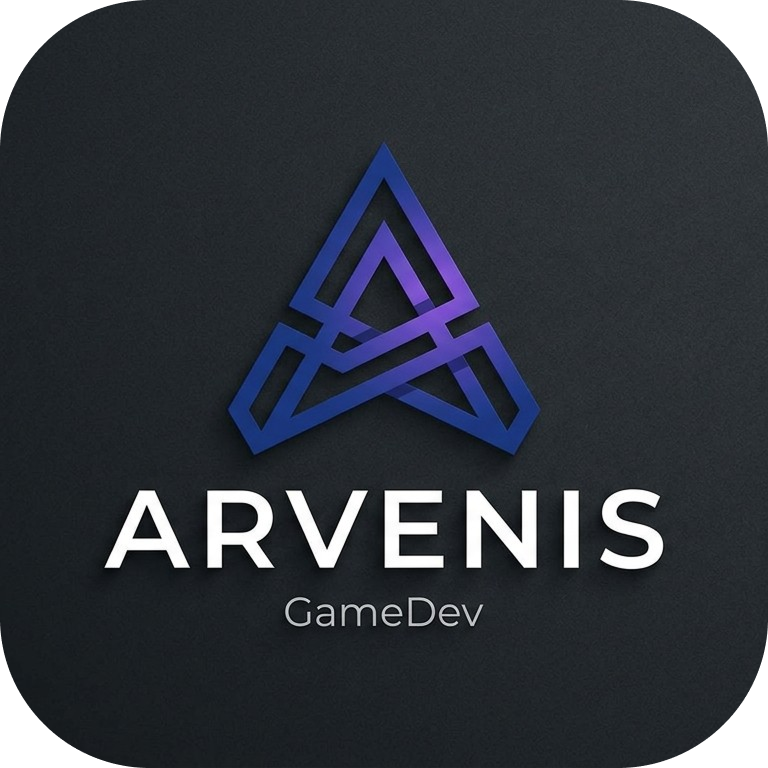
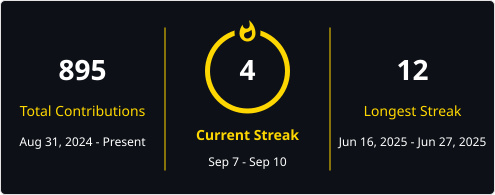

<h1 align="center">
  
</h1>

  
  
  
  

## 💻 Sobre Mim

Sou estudante de Sistemas de Computação na UESPI e desenvolvedor <strong>Full-Stack</strong>, com foco em desenvolvimento de aplicações, arquitetura de software, desenvolvimento de jogos e criação de produtos.
Tenho interesse em construir sistemas organizados, escaláveis e desacoplados, buscando aplicar boas práticas de engenharia de software nos projetos que desenvolvo. Também atuo no desenvolvimento de jogos com Godot e sou cofundador da <strong>Arvenis Studio</strong>, onde atualmente lidero o desenvolvimento do nosso primeiro projeto multiplayer, <strong>Letra a Letra</strong>.

## 🛠️ Tech Stack

<table>
<tr>
<td width="25%" align="center">

### Frontend

</td>
<td width="25%" align="center">

### Backend & DB

</td>
<td width="25%" align="center">

### Tools & DevOps

</td>
<td width="25%" align="center">

### Mobile & GameDev

</td>
</tr>

<tr>
<td width="25%" align="center">

</td>
<td width="25%" align="center">

</td>
<td width="25%" align="center">

</td>
<td width="25%" align="center">

</td>
</tr>
</table>

## 🚀 **Projetos**
| Projeto | Descrição | Tecnologias |
|----------|-----------|-------------|
| **Letra a Letra** | Jogo multiplayer competitivo em desenvolvimento pela Arvenis. | Java • Spring Boot • Godot • PostgreSQL • Redis • WebSocket |
| **Estocai** | Sistema para gerenciamento de estoque. | Next.js • Typescript • PrismaORM |
| **Simulador de escalonamento de processos(FIFO & SJF)** | Aplicação para simular e visualizar algoritmos de escalonamento de processos. | Next.js • Typescript |

#  Arvenis Studio

A <strong>Arvenis Studio</strong> é um estúdio independente de desenvolvimento de jogos, criado com o propósito de transformar ideias em experiências interativas, divertidas e memoráveis.

Como <strong>cofundador e desenvolvedor</strong>, atuo diretamente na criação dos nossos projetos, unindo desenvolvimento de software, arquitetura e <i>game development</i>.
Atualmente, lidero o desenvolvimento do <strong>Letra a Letra</strong>, nosso primeiro projeto: um jogo multiplayer competitivo desenvolvido com <strong>Godot, Java, Spring Boot, PostgreSQL, Redis e WebSocket</strong>.

Mais do que desenvolver jogos, buscamos construir uma identidade própria e criar experiências que combinem <strong>criatividade, tecnologia e diversão</strong>.

## 📊 GitHub Stats

 
 

  

  <picture>
    <source 
      media="(prefers-color-scheme: dark)" 
      srcset="https://raw.githubusercontent.com/Gabriel-afk-9/Gabriel-afk-9/output/github-snake-dark.svg"
    />
    <source 
      media="(prefers-color-scheme: light)" 
      srcset="https://raw.githubusercontent.com/Gabriel-afk-9/Gabriel-afk-9/output/github-snake.svg"
    />
    
  </picture>

>>

